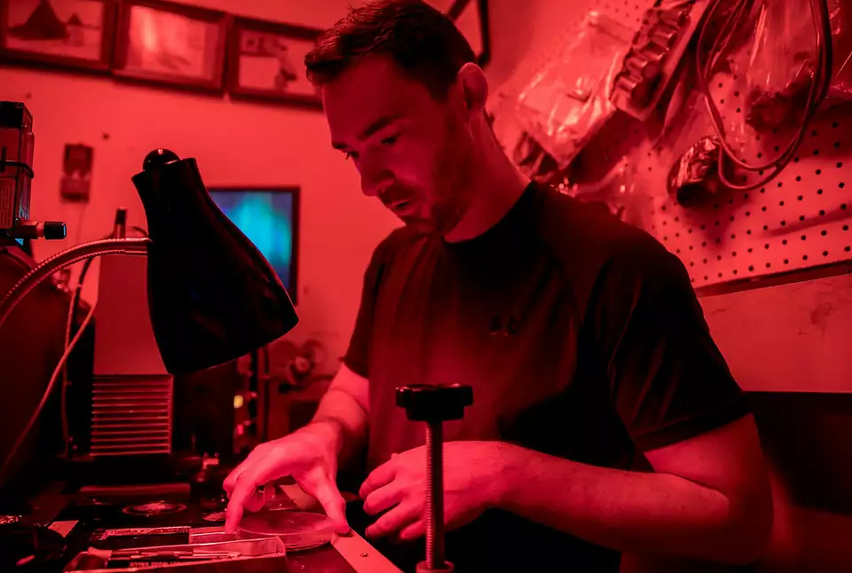

**Welcome to my page. I am a researcher in planetary geology, studying the dynamic processes of otherworldly landscapes to support the scientific exploration of our solar system.**

---

I am primarily interested in analyzing returned samples, with a focus on thermoluminescence and petrological studies. These samples include both lunar and meteorite specimens, which provide critical insights into the geological history and processes of our solar system.

Additionally, I am involved in the development of advanced space instruments for both human and robotic exploration missions. My goal is to create innovative tools that support the scientific exploration of other celestial bodies.

My research also involves studying terrestrial analogs, which are Earth-based environments that simulate extraterrestrial conditions. These analogs help us understand the geological processes and provide valuable insights into the geological features and histories of other planetary bodies.
